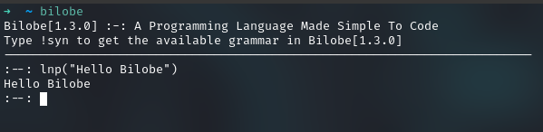

# **Bilobe[1.4.0]**
### A New Programming Language Made To Be Simple, Fast And Efficient

## Requirements
 - Everything is taken care by the Bilobe installer
 - Just follow the installation instructions.

## Usage

_Once the building and installation of Bilobe is done, you can follow the below instruction according to your OS:_

On UNIX-Based Systems you can start it from your terminal by the command `bilobe`.  
On Windows OS, u can start it by just running the .exe file that you have downloaded

Alternatively you can create a file with the extension `.bi` and in the terminal type `bilobe /path/to/file.bi` to compile and run the program.
For a idea on the content of the file, check out the `sample.bi` file in the repo.

## Installation

1. UNIX-Based Systems:

    - `git clone https://github.com/GNVageesh/Bilobe.git`  
    - `bash install.sh` 

    - Alternatively you can download the .sh file from the Bilobe Releases page.
    - And then run the following command to make it executable.
    - `chmod +x /path/to/file/Bilobe-xxx.sh`
    - And running it by `./Bilobe-xxx.sh`
    - Further to access it system-wide, copy it to the bin folder by running `sudo cp /path/to/Bilobe-xxx.sh /usr/bin/`

    - On DEBIAN Based Linux Systems you can download the `bilobe-xxx-Linux.deb` file from the releases page.
    - `cd /path/to/bilobe-xxx-Linux.deb`
    - `sudo dpkg -i bilobe-xxx-Linux.deb`
    - This will automatically adds Bilobe to `/usr/bin/`, making bilobe globally available for use

    > **_This will run the Bilobe script installer and it will automatically install all the required application according to your system's package manager and will enable bilobe command globally._**

2. Windows OS

    
    - On Windows, WSL or WSL2 is required to run and get the necessary files.
    - Alternatively you can download the .exe file from Bilobe Releases Page.

## Updating Bilobe

1. UNIX-Based Systems

    - `cd /to/the/bilobe/repoFolder` 
    - `bash update.sh`

    - Alternatively you can download the .sh file from the release page that will be updated with the new version, and follow the same steps of the alternative installation procedure 

    > **_This will pull the code from the repo and rebuild Bilobe with the new version._**

2. Windows OS

    - You can delete the older version of Bilobe and install the latest version, which will be released at the same time when released for UNIX Systems

## Uninstalling Bilobe

1. UNIX-Based Systems

    - `cd /to/the/bilobe/repoFolder` 
    - `bash uninstall.sh`

    > **_This will remove bilobe completely form your system._**

2. Windows OS

    - You can just remove Bilobe by just deleting the .exe file that you had downloaded before

## Advice for Windows OS Users

**Though the Bilobe executable file is released simultaneously with the build release, you wont be able to use Bilobe throughout your Windows machine, unless u dont add the .exe file to the system path. A wave to tackle this until an installer release of Bilobe is made for Windows, you can use the Windows Sub-System For Linux(WSL or WSL2), with which u can do all the setup that can be done on UNIX-Based Systems.**

## Grammar Available right now

| Function | Examples             | Result      | Description                          |
| :------: | :------------------: | :---------: | :------------------:                 |
| lnp()    | `lnp("I am Bilobe")` | I am Bilobe | Prints the text                      |
| lens()   | `lens("Bilobe")`     | 6           | Prints the length of a String        |
| leni()   | `lens(89243)`        | 5           | Prints the length of a number        |
| exit()   | `exit(bi)`           |             | Exit Bilobe from the console         |
| #        | `# This is a comment`|             | Commenting in Bilobe starts with a # |
| Maths    | `(2+2)^2/2*2+2-2`    |16           | Basic Maths like a calculator        |

 
## Bilobe[1.4.0] commands

 - `!syn` --> Provides the available Syntax with examples in Bilobe

## Happy Coding😄

